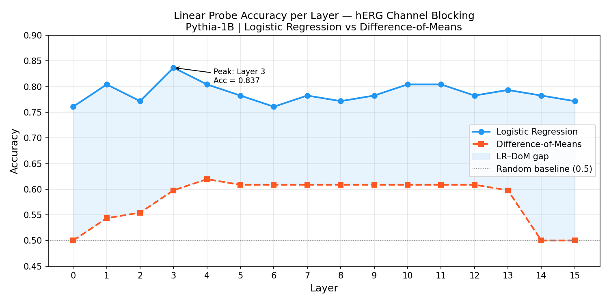
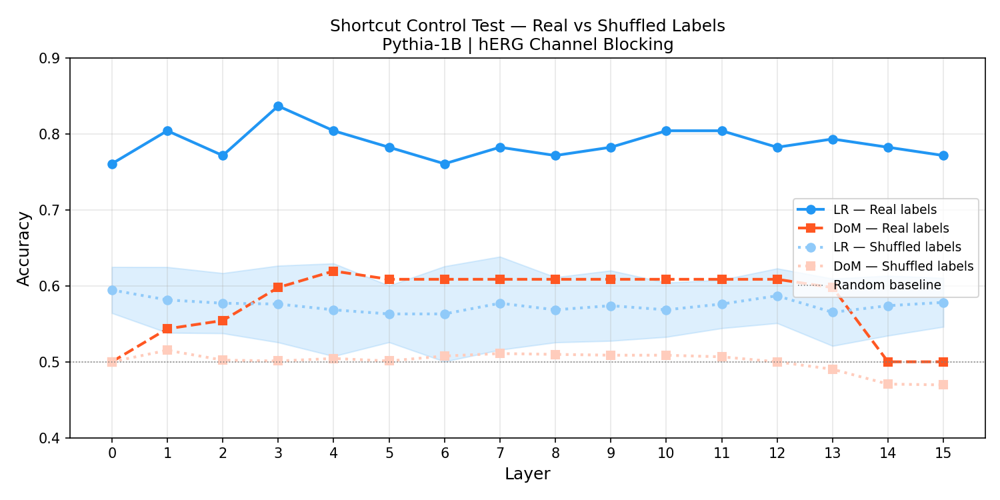

# Linear Probing for Scientific Concepts in LLM Representations
### Evaluating hERG Channel Blocking Concept Encoding in Pythia-1B

*A sample project in the context of EleutherAI SOAR — 
aligned with project I-2: Evaluating Interpretability Methods 
for Scientific Reasoning (Mentor: Manjari Narayan, Stanford)*

---

## Research Question

Does Pythia-1B internally encode the concept of **hERG channel 
blocking** (a key drug cardiotoxicity marker) in its layer-wise 
representations — and if so, where?

We test this using two linear probing methods:
- **Logistic Regression (LR)** — learned linear boundary
- **Difference-of-Means (DoM)** — geometric concept direction

---

## Key Findings

### 1. Layer-wise Probe Accuracy


- LR peaks at **Layer 3** (accuracy = **0.837**)
- DoM plateaus at **~0.609**, significantly below LR
- Neither method peaks at the final layer — 
  concept encoding is strongest in early-to-mid layers

### 2. Shortcut Control Test


- Real labels: **0.761–0.837** across layers
- Shuffled labels: **~0.570** (near class-imbalance baseline)
- Consistent gap of **+0.17 to +0.26** across all 16 layers
- Confirms the probe is detecting genuine concept encoding, 
  not spurious artifacts

---

## Core Interpretation

The persistent **LR >> DoM** gap (~0.23 at peak) suggests 
hERG blocking is **not encoded as a clean geometric direction** 
in Pythia-1B's activation space. Logistic Regression must learn 
a more complex linear boundary to recover the concept — a finding 
directly relevant to evaluating whether interpretability methods 
(specifically DoM-based approaches) make valid causal claims 
about scientific concept representation.

---

## Methods

| Component | Choice | Reason |
|---|---|---|
| Model | Pythia-1B (EleutherAI) | Well-studied, open-weights, 16 layers |
| Dataset | hERG (TDC) | Binary cardiotoxicity classification |
| Input | SMILES wrapped in text template | LLM-compatible text format |
| Probe 1 | Logistic Regression | Standard linear probe baseline |
| Probe 2 | Difference-of-Means | Geometric direction method (Zou et al., 2023) |
| Control | Permutation test (10 shuffles) | Validates signal is not artifactual |
| Activation | Last token hidden state per layer | Most context-rich position in causal LM |

---

## Results Summary

| Layer | LR Accuracy | DoM Accuracy | LR–DoM Gap |
|-------|-------------|--------------|------------|
| 0     | 0.761       | 0.500        | +0.261     |
| 3     | **0.837**   | 0.598        | **+0.239** |
| 10    | 0.804       | 0.609        | +0.195     |
| 15    | 0.772       | 0.500        | +0.272     |

---

## Reproducing Results

```bash
# 1. Install
pip install -r requirements.txt

# 2. Download data
python data/herg_data.py

# 3. Extract activations (GPU recommended)
python scripts/extract_activations.py

# 4. Train probes
python scripts/train_probes.py

# 5. Plot
python scripts/plot_results.py

# 6. Shortcut test
python scripts/shortcut_test.py
```

---

## References

- Zou et al. (2023). *Representation Engineering: 
  A Top-Down Approach to AI Transparency.*
- Alain & Bengio (2016). *Understanding intermediate layers 
  using linear classifier probes.*
- Guo et al. (2023). *Therapeutics Data Commons.*
- EleutherAI. *Pythia: A Suite for Analyzing Large Language Models.*